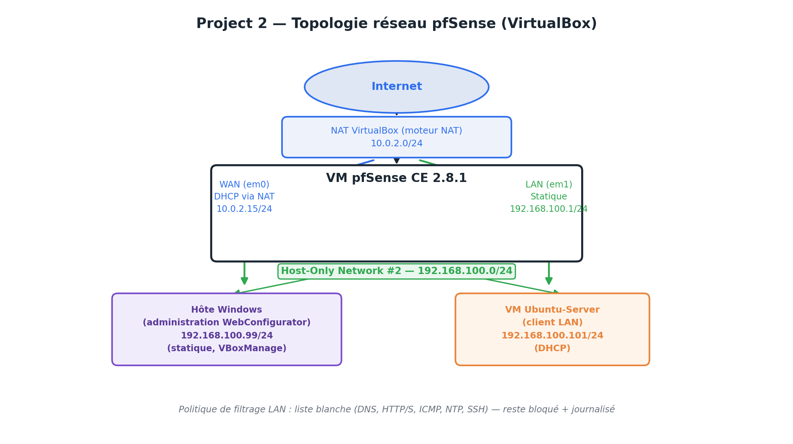

# Project 2 — Pare-feu pfSense CE (VirtualBox)

**Statut : terminé** | **Environnement : VirtualBox, pfSense Community Edition 2.8.1**

## Sommaire

- [1. Objectif](#1-objectif)
- [2. Architecture réseau](#2-architecture-réseau)
- [3. Installation de pfSense](#3-installation-de-pfsense)
- [4. Troubleshooting : accès au WebConfigurator](#4-troubleshooting--accès-au-webconfigurator)
- [5. Assistant de configuration initiale](#5-assistant-de-configuration-initiale)
- [6. Politique de pare-feu LAN](#6-politique-de-pare-feu-lan)
- [7. Tests de validation](#7-tests-de-validation)
- [8. Compétences démontrées](#8-compétences-démontrées)
- [9. Pistes d'amélioration](#9-pistes-damélioration)
- [📸 Galerie de captures d'écran complète](screenshots/README.md)

---

## 1. Objectif

Déployer et durcir un pare-feu **pfSense Community Edition** dans un environnement virtualisé (VirtualBox), afin de démontrer :

- la segmentation d'un réseau WAN/LAN avec NAT ;
- la résolution d'un incident réseau réel (conflit d'adressage IP) ;
- l'application du principe du **moindre privilège** sur une politique de pare-feu (liste blanche plutôt que liste noire) ;
- la validation d'une configuration de sécurité par les tests et l'analyse de logs.

## 2. Architecture réseau



| Élément | Interface | Adressage | Rôle |
|---|---|---|---|
| VM pfSense — WAN | em0 | DHCP via NAT VirtualBox (`10.0.2.15/24`) | Sortie Internet |
| VM pfSense — LAN | em1 | Statique `192.168.100.1/24` | Passerelle + DHCP + résolveur DNS du LAN |
| VM Ubuntu-Server | client LAN | DHCP (`192.168.100.101/24`) | Poste client de test |
| Hôte Windows | VirtualBox Host-Only Adapter #2 | Statique `192.168.100.99/24` | Administration du WebConfigurator pfSense |

Le réseau LAN utilise un **adaptateur Host-Only VirtualBox** plutôt qu'un simple Réseau interne (`intnet`), afin que la machine hôte Windows puisse elle-même faire partie du segment LAN et accéder à l'interface d'administration de pfSense depuis un navigateur.

## 3. Installation de pfSense

- pfSense CE 2.8.1 installé sur une VM dédiée (2 interfaces réseau)
- **Adapter 1 (WAN)** : NAT — inchangé, sortie Internet native de VirtualBox
- **Adapter 2 (LAN)** : Réseau privé hôte (Host-only Adapter), lié à `VirtualBox Host-Only Ethernet Adapter #2`
- VM Ubuntu-Server (réutilisée du Project 3) basculée sur le même adaptateur Host-Only pour jouer le rôle de client LAN

## 4. Troubleshooting : accès au WebConfigurator

Cette section documente deux incidents réels rencontrés et leur résolution — une partie volontairement conservée pour illustrer une démarche de diagnostic, pas seulement le résultat final.

### 4.1 Localisation du gestionnaire de réseaux Host-Only

Sur les versions récentes de VirtualBox (7.x), le *Host Network Manager* historique a été fusionné dans **Fichier > Préférences > Réseau** (ou **Outils > Réseau**). Le diagnostic et la création de l'interface ont été faits en ligne de commande, plus fiable :

```powershell
# Lister les interfaces Host-only existantes
& "C:\Program Files\Oracle\VirtualBox\VBoxManage.exe" list hostonlyifs

# Créer une nouvelle interface Host-only
& "C:\Program Files\Oracle\VirtualBox\VBoxManage.exe" hostonlyif create

# Assigner une IP statique à l'interface côté Windows
& "C:\Program Files\Oracle\VirtualBox\VBoxManage.exe" hostonlyif ipconfig `
    "VirtualBox Host-Only Ethernet Adapter #2" --ip 192.168.100.99 --netmask 255.255.255.0
```

### 4.2 Conflit d'adressage IP avec le réseau domestique

**Symptôme** : après configuration initiale du LAN pfSense en `192.168.1.1/24`, la tentative d'accès à `https://192.168.1.1` depuis le navigateur Windows affichait l'interface d'administration de la **box Internet Orange (Flybox)**, et non celle de pfSense.

**Cause racine** : la box Orange utilise elle aussi `192.168.1.0/24` avec `192.168.1.1` comme IP de gestion sur le réseau domestique physique. Windows disposait donc de **deux interfaces actives revendiquant le même sous-réseau** (la carte réseau physique vers la Flybox, et l'adaptateur Host-Only vers pfSense) ; le système a résolu l'ambiguïté de routage en faveur de la carte physique.

**Correction** : renumérotation complète du réseau de labo vers un sous-réseau **`192.168.100.0/24`**, absent du réseau domestique, afin d'éliminer tout chevauchement :

- LAN pfSense reconfiguré en `192.168.100.1/24` via la console (option `2 — Set interface(s) IP address`)
- Plage DHCP définie de `192.168.100.100` à `192.168.100.200`
- Adaptateur Host-Only Windows réassigné en conséquence (`192.168.100.99/24`)

Ce type de conflit est un piège classique en environnement de lab virtualisé partageant le même plan d'adressage RFC1918 que le réseau réel de l'opérateur ; il illustre l'importance de vérifier l'absence de chevauchement de sous-réseaux avant tout déploiement.

## 5. Assistant de configuration initiale

Réalisé via le *Setup Wizard* pfSense :

- **Hostname / Domaine** : `pfSense` / `home.arpa` (alternative recommandée à `.local`, qui entre en conflit avec les résolutions mDNS/Bonjour/AirPlay)
- **DNS** : laissés vides, résolution déléguée au DNS fourni par le WAN (comportement par défaut du résolveur pfSense)
- **WAN** : configuration DHCP conservée

  > ⚠️ **Point de configuration critique** : les options *Block private networks* (RFC1918) et *Block bogon networks* ont été **désactivées** sur l'interface WAN. En environnement VirtualBox/NAT, le WAN reçoit une adresse privée (`10.0.2.15`, plage RFC1918). Si ces protections restent actives, pfSense bloque son propre trafic de retour NAT légitime et perd l'accès Internet — ces options sont pensées pour un WAN exposé directement sur Internet, pas pour un WAN en adressage privé.

- **LAN** : `192.168.100.1/24`
- **Mot de passe administrateur** : modifié depuis la valeur par défaut (`pfsense`)

<table><tr>
<td><br/><sub>Assistant de configuration terminé</sub></td>
<td><br/><sub>Dashboard — vérification post-configuration</sub></td>
</tr></table>

## 6. Politique de pare-feu LAN

La règle par défaut de pfSense (*Default allow LAN to any*) autorise tout le trafic sortant du LAN, sans restriction. Cette règle a été **désactivée** (conservée pour référence) et remplacée par un jeu de règles explicites suivant le principe du **moindre privilège** : seuls les services nécessaires sont autorisés, tout le reste est bloqué et journalisé.

| # | Règle | Protocole | Source | Destination | Port | Description |
|---|---|---|---|---|---|---|
| 1 | Anti-Lockout *(native)* | * | * | LAN Address | 80 / 443 | Protège l'accès permanent au WebConfigurator |
| 2 | Default allow LAN to any (IPv4) | IPv4 * | LAN subnets | any | any | **Désactivée** |
| 3 | Default allow LAN IPv6 to any | IPv6 * | LAN subnets | any | any | **Désactivée** (IPv6 non utilisé) |
| 4 | DNS | TCP/UDP | LAN subnets | *This Firewall (self)* | 53 | Résolution DNS via le résolveur pfSense |
| 5 | HTTP | TCP | LAN subnets | any | 80 | Navigation web, `apt update`/`install` |
| 6 | HTTPS | TCP | LAN subnets | any | 443 | Navigation web sécurisée |
| 7 | ICMP Echo Request | ICMP | LAN subnets | any | — | Ping / diagnostics réseau |
| 8 | NTP | UDP | LAN subnets | any | 123 | Synchronisation horaire |
| 9 | SSH | TCP | LAN subnets | any | 22 | `git push` en SSH (GitHub) |
| 10 | **Block + Log** | any | LAN subnets | any | any | Blocage et journalisation de tout trafic non autorisé |


*Capture des règles complètes une fois appliquées. Le détail de la création de chaque règle (HTTP, HTTPS, ICMP, Block+Log) est disponible dans la [galerie de captures](screenshots/README.md).*

**Notes de conception :**

- La règle DNS cible explicitement *This Firewall (self)* plutôt que `any` : le résolveur DNS est pfSense lui-même, restreindre la destination évite qu'un usage détourné (DNS tunneling vers un serveur externe) ne soit implicitement autorisé.
- La règle finale utilise l'action **Block** (rejet silencieux) plutôt que **Reject** (rejet avec notification explicite à l'émetteur), afin de ne pas révéler d'information sur la politique de filtrage à un éventuel attaquant.
- Aucune règle explicite n'a été créée pour le trafic de retour (réponses DNS, HTTP, ping) : pfSense fonctionne en **pare-feu à états (stateful)**, il autorise automatiquement les réponses aux connexions initiées depuis le LAN.

## 7. Tests de validation

Tests réalisés depuis la VM Ubuntu-Server après application de la politique de pare-feu.

**Trafic autorisé — DNS et ICMP :**
```bash
$ ping -c 3 google.com
PING google.com (172.217.22.110) 56(84) bytes of data.
64 bytes from fra15s18-in-f110.1e100.net (172.217.22.110): icmp_seq=1 ttl=62 time=62.2 ms
64 bytes from fra15s18-in-f110.1e100.net (172.217.22.110): icmp_seq=2 ttl=62 time=45.3 ms
64 bytes from fra15s18-in-f110.1e100.net (172.217.22.110): icmp_seq=3 ttl=62 time=44.3 ms

--- google.com ping statistics ---
3 packets transmitted, 3 received, 0% packet loss, time 6123ms
```

**Trafic autorisé — HTTPS :**
```bash
$ curl -I https://www.google.com
HTTP/2 200
...
```

**Trafic bloqué — port non autorisé (8080) :**
```bash
$ curl -m 5 http://example.com:8080
curl: (28) Connection timed out after 5038 milliseconds
```

**Vérification des logs pfSense** (*Status > System Logs > Firewall*) : les tentatives de connexion vers le port 8080 apparaissent bien journalisées, avec la source, la destination et l'action de blocage :

| Action | Interface | Règle | Source | Destination | Protocole |
|---|---|---|---|---|---|
| ❌ Block | LAN | Block and log all other LAN traffic | 192.168.100.101:43436 | 104.20.23.154:8080 | TCP:S |
| ❌ Block | LAN | Block and log all other LAN traffic | 192.168.100.101:52874 | 172.66.147.243:8080 | TCP:S |


Les trois tests confirment le comportement attendu : le trafic explicitement autorisé passe, tout le reste est bloqué silencieusement et tracé.

## 8. Compétences démontrées

- Conception et déploiement d'une architecture réseau segmentée (WAN/LAN, NAT, réseau Host-Only)
- Diagnostic méthodique d'un incident réseau réel (conflit d'adressage IP entre labo et réseau domestique)
- Compréhension du filtrage stateful et de ses implications sur la conception de règles
- Application du principe du moindre privilège dans une politique de pare-feu
- Lecture et interprétation de logs de sécurité à des fins de validation

## 9. Pistes d'amélioration

Non réalisées dans cette itération, envisageables pour une version future du projet :

- NAT / redirection de ports (port forwarding) pour exposer un service interne
- VPN site-à-site ou accès distant (OpenVPN / WireGuard) sur pfSense
- Intégration d'un IDS/IPS (Suricata) ou d'un filtrage DNS (pfBlockerNG)

---

## 📸 Captures d'écran

L'intégralité des captures (assistant de configuration, création de chaque règle de pare-feu, logs) est disponible dans la **[galerie dédiée](screenshots/README.md)**.

---

*Projet réalisé dans le cadre d'un portfolio de cybersécurité — [github.com/Jwandji3218/portfolio-Reseau-Cyber](https://github.com/Jwandji3218/portfolio-Reseau-Cyber)*
