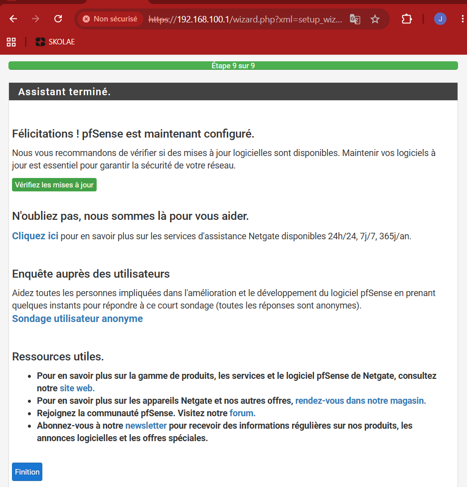
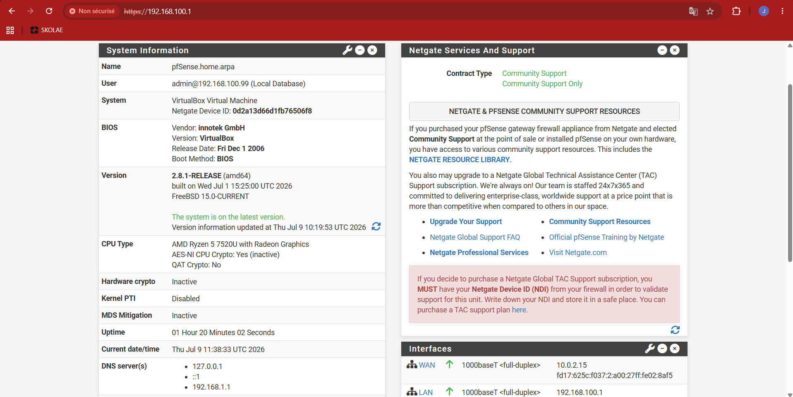
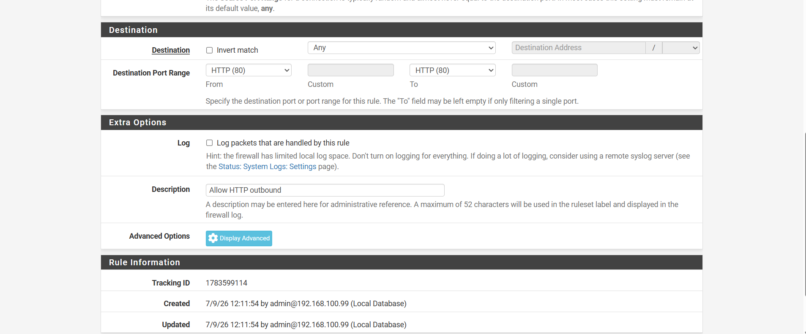
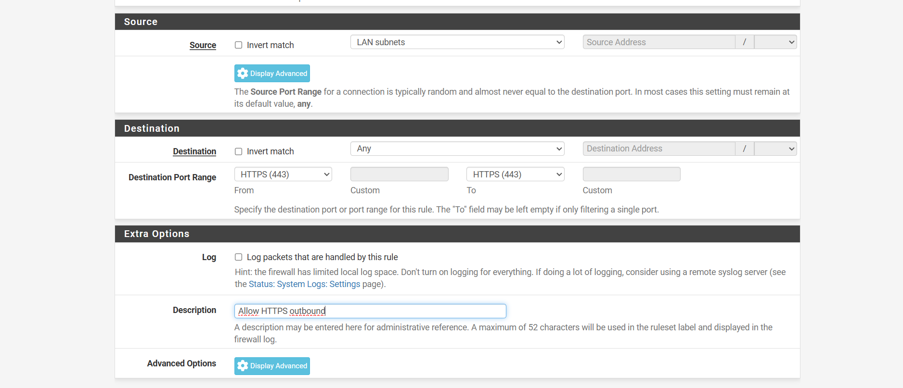
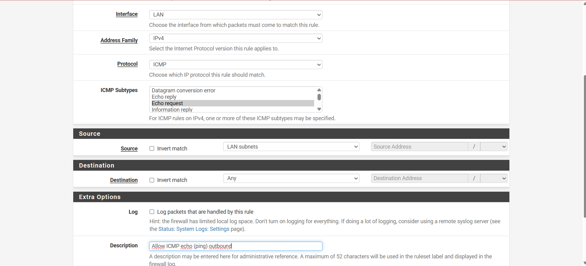
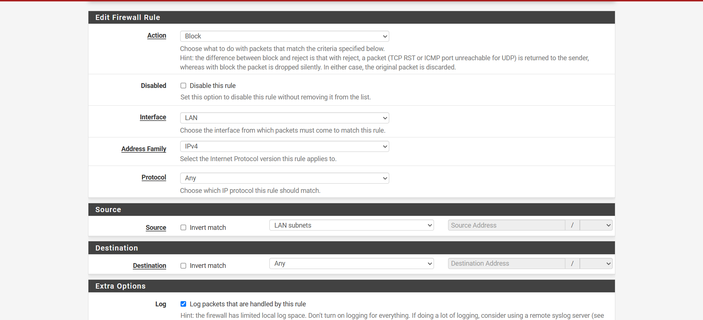
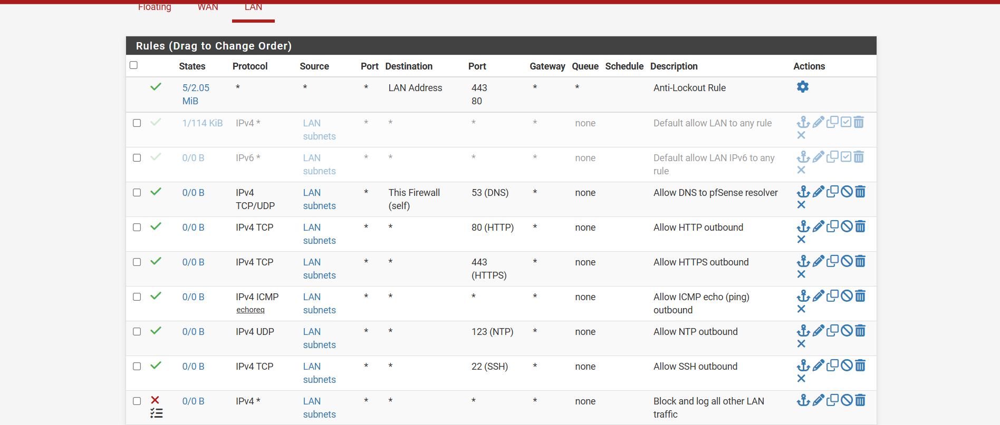
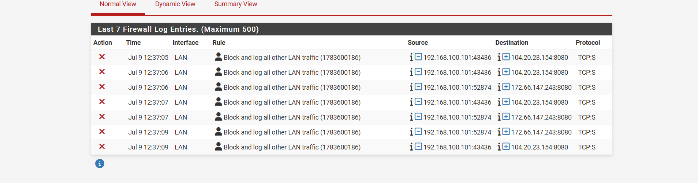

# Captures d'écran — Project 2 (pfSense CE)

Cette galerie complète le [README principal](../README.md) avec les captures détaillées de chaque étape clé de la configuration. Elle suit l'ordre chronologique du projet.

---

## 1. Assistant de configuration initiale terminé

Fin du *Setup Wizard* pfSense (étape 9/9) : hostname, domaine, WAN/LAN et mot de passe administrateur configurés avec succès.

---

## 2. Tableau de bord — vérification post-configuration

Widget *System Information* du dashboard confirmant la configuration effective : version pfSense CE 2.8.1, adresse LAN `192.168.100.1`, WAN en DHCP (`10.0.2.15`), DNS résolus.

---

## 3. Règle de pare-feu — HTTP (port 80)

Création de la règle autorisant le trafic sortant LAN vers le port 80 (navigation web, `apt update`/`install`). Le bloc *Rule Information* en bas confirme la traçabilité (Tracking ID, auteur, horodatage).

---

## 4. Règle de pare-feu — HTTPS (port 443)

Règle équivalente pour le trafic HTTPS sortant, créée séparément de la règle HTTP plutôt qu'en une plage 80–443, pour éviter d'autoriser des ports intermédiaires inutiles.

---

## 5. Règle de pare-feu — ICMP Echo Request (ping)

Seul le sous-type *Echo Request* est autorisé : suffisant pour initier un ping depuis le LAN, les réponses (*Echo Reply*) étant gérées automatiquement par le suivi d'état (stateful firewall) de pfSense.

---

## 6. Règle finale — Blocage et journalisation

Dernière règle de la politique : action `Block` (rejet silencieux, par opposition à `Reject`), protocole `Any`, avec l'option **Log packets that are handled by this rule** cochée — c'est elle qui alimente les logs de la capture n°8.

---

## 7. Vue d'ensemble des règles LAN

L'intégralité de la politique de pare-feu LAN une fois appliquée : règle Anti-Lockout native, les deux règles par défaut désactivées (conservées pour référence), les six règles d'autorisation explicites (DNS, HTTP, HTTPS, ICMP, NTP, SSH), et la règle de blocage final.

---

## 8. Logs — trafic bloqué et journalisé

Extrait de *Status > System Logs > Firewall* : sept tentatives de connexion depuis `192.168.100.101` (Ubuntu-Server) vers le port `8080/tcp`, toutes bloquées par la règle finale — preuve du bon fonctionnement de la politique en liste blanche.

---

*Retour au [README principal du Project 2](../README.md)*
