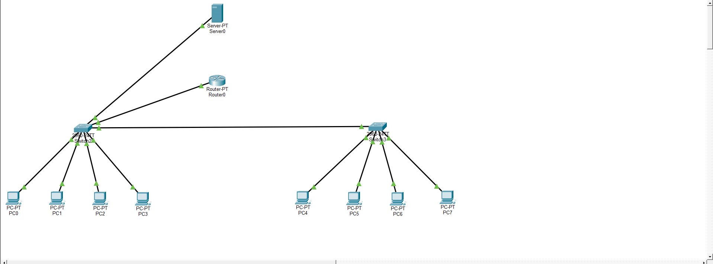

# Portfolio — Réseau & Cybersécurité

**Étudiant Bachelor Cybersécurité, en recherche d'alternance**

Ce dépôt rassemble des projets pratiques réalisés en autonomie pour développer et démontrer des compétences en administration réseau, sécurisation de systèmes et méthodologie de test. Chaque projet est documenté avec son architecture, les configurations appliquées, les tests de validation et les compétences mobilisées.

## Sommaire des projets

| # | Projet | Statut | Stack |
|---|---|---|---|
| 1 | [Conception d'un réseau d'entreprise segmenté](./Project-1-VLAN-ACL) | ✅ Terminé | Cisco Packet Tracer — VLAN, Router-on-a-Stick, DHCP relay, ACL |
| 2 | [Firewall périmétrique pfSense](./Project-2-pfSense) | 🔜 À venir | pfSense — WAN/LAN, NAT, filtrage |
| 3 | [Durcissement d'un serveur Linux](./Project-3-Linux-Hardening) | ✅ Terminé | Ubuntu Server, VirtualBox — SSH, UFW, Bash |

---

## Project 1 — Conception d'un réseau d'entreprise segmenté

Réseau d'entreprise simulé à quatre services (Direction, RH, IT, Invités), avec segmentation VLAN, routage inter-VLAN et politique de sécurité par ACL selon le principe de moindre privilège.

**Compétences démontrées** : VLAN, trunk 802.1Q, Router-on-a-Stick, DHCP relay, ACL étendues, méthodologie de test réseau.

📄 [Documentation complète](./Project-1-VLAN-ACL/Conception-Reseau-Entreprise.pdf) · 🗂️ [Fichier Packet Tracer](./Project-1-VLAN-ACL/Reseau-Entreprise.pkt)

---

## Project 2 — Firewall périmétrique pfSense

*Projet planifié.* Objectif : configurer un firewall périmétrique séparant un réseau interne (LAN) d'un réseau externe (WAN), avec routage NAT et règles de filtrage — en complément du Project 1 (segmentation interne) et du Project 3 (durcissement d'un hôte).

**Compétences visées** : installation et configuration pfSense, séparation de zones réseau, NAT, règles de pare-feu périmétrique, administration via interface web.

---

## Project 3 — Durcissement d'un serveur Linux

Sécurisation d'un serveur Ubuntu (VM VirtualBox) : authentification SSH par clé ed25519, désactivation du mot de passe et de la connexion root, pare-feu UFW en refus par défaut, et script d'audit Bash automatisé produisant un rapport de sécurité horodaté.

**Compétences démontrées** : administration Linux via SSH, cryptographie appliquée (clés ed25519), durcissement OpenSSH (diagnostic de configuration effective avec `sshd -T`), pare-feu UFW, scripting Bash, méthodologie de validation (tests positifs et négatifs).

📄 [Documentation complète](./Project-3-Linux-Hardening/Durcissement-Serveur-Linux.pdf) · 💻 [Script d'audit](./Project-3-Linux-Hardening/audit.sh) · 🖼️ [Captures d'écran](./Project-3-Linux-Hardening/captures)

---

## Environnement technique

- **Virtualisation** : Oracle VirtualBox
- **Systèmes** : Ubuntu Server, Windows
- **Réseau** : Cisco Packet Tracer, pfSense
- **Scripting** : Bash
- **Gestion de version** : Git / GitHub
